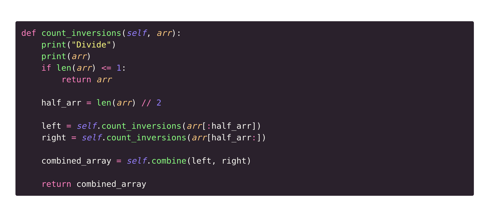
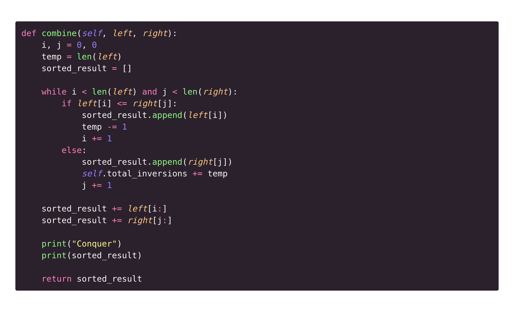
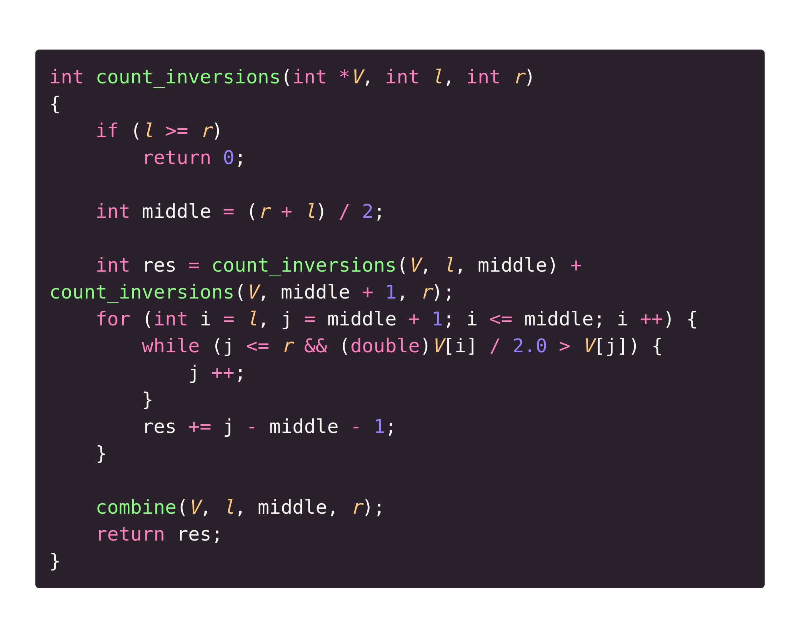
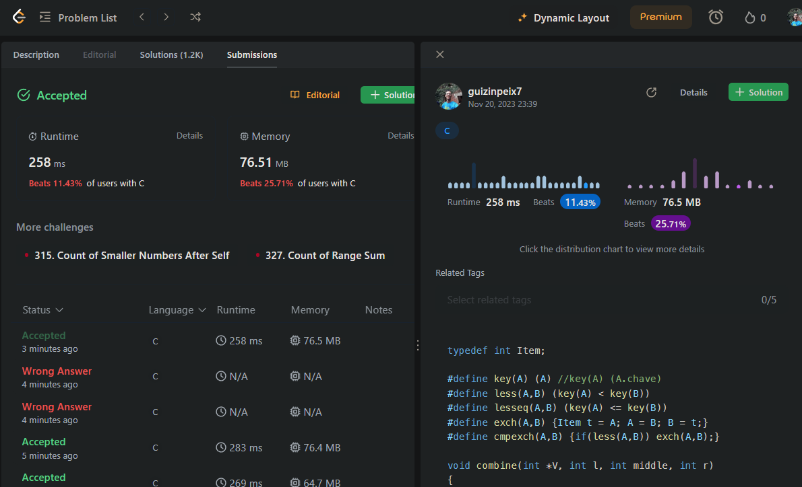
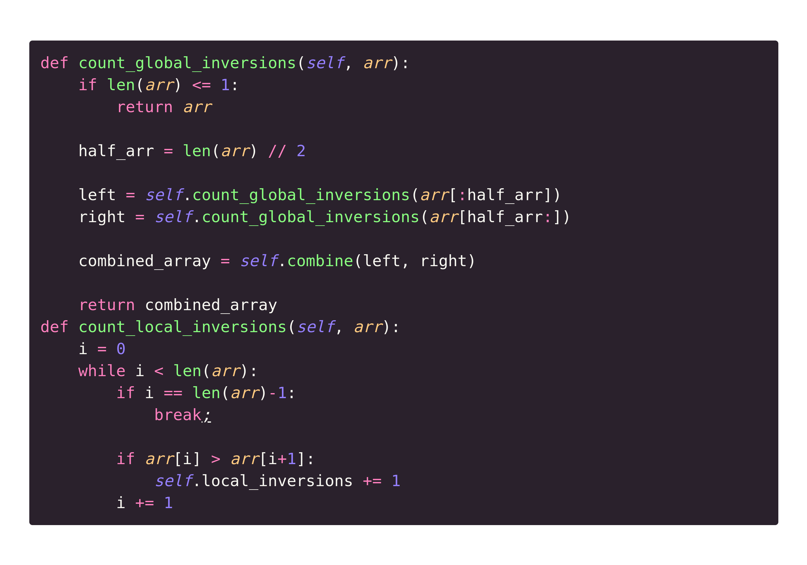
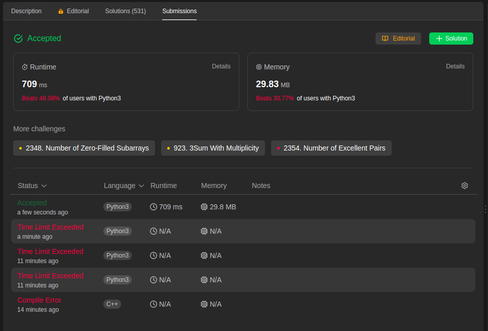

# **Contagem de Inversões**

**Número da Lista**: 1<br>
**Conteúdo da Disciplina**: Dividir e Conquistar<br>

## **Alunos**
|Matrícula | Aluno |
| -- | -- |
| 17/0140571  |  Douglas Farias de Castro |
| 17/0034941  |  Guilherme Peixoto |

## **Sobre**
O projeto atual faz parte de quarta entrega da disciplina de Projeto de Algoritmos. O objetivo é exercitar o algoritmo de contagem de inversões. Na primeira parte foi desenvolvido a base onde é possível ver as etapas desse algoritmo e na segunda foi resolvido problemas do juiz online [Leet Code](https://leetcode.com/).

## **Screenshots**

### **Contagem de Inversão (Dividir)**


### **Combine(Conquistar)**


### **Problema 493: Reverse Pairs**

- Link: [Problema](https://leetcode.com/problems/reverse-pairs/)
- Dificuldade: Difícil

#### **Código**


#### **Resultado**


### **Problema 755: Reverse Pairs**

- Link: [Problema](https://leetcode.com/problems/global-and-local-inversions/)
- Dificuldade: Médio

#### **Código**


#### **Resultado**


## **Instalação**
**Linguagem**: Python e C<br>

Para executar o projeto é necessário ter instalado em sua máquina o Python 3.

## **Uso**

Para executar é muito simples, basta rodar os comandos abaixo no terminal:

### **Base:**

```bash
  python3 algorithm/CountingInversion.py
```

### **Problema 755:**

Para rodar o código local em Python basta criar uma função main, declarar um array e rodar o seguintes comando:

```bash
  python3 problems/775.py
```

### **Problema 493:**

Para rodar o código local em C basta criar uma função main, declarar um array e rodar o seguintes comando:

```bash
  gcc problems/493.c && ./a.out
```

## **Apresentação**
Foi gravado um vídeo explicando a solução de cada um dos exercícios, segue o [link](2023-11-21-00-25-04_MkCtEf2K.mp4)

OBS.: O vídeo está com a extensão .mp4 e deve ser baixado para que possa ser assistido.


